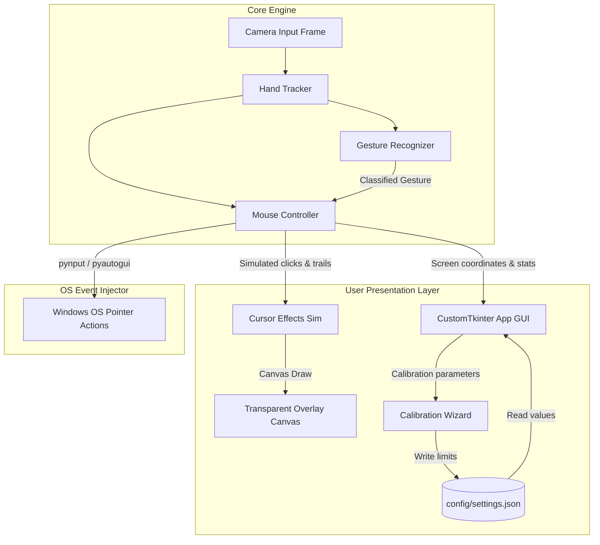

# 🖐️ SmartAir Mouse Pro

[](https://www.python.org/)
[](LICENSE)
[]()

A professional, portfolio-grade computer vision application that turns hand gestures into lag-free virtual mouse controls using classical computer vision. Built with Python, OpenCV, and MediaPipe Hands, featuring a state-of-the-art transparent desktop overlay with glowing neon cursor trails, click physics particles, sound synthesis, a calibration wizard, and a browser-based sandbox.

---

## 🌟 Key Features

* **Lag-Free Adaptive Smoothing**: Integrates a custom **2D Kalman Filter** state-estimator combined with **Exponential Moving Averages** (EMA) and dynamic velocity-scaling mouse acceleration.
* **Augmented Reality Screen Overlay**: A transparent, click-through, topmost Windows canvas that renders:
  * Neon cursor halo rings
  * Fading cursor movement trails
  * Expansive mouse click ripples and physical particle explosions
  * Dynamic head-up-display (HUD) showing live status, FPS, and tracking confidence
  * Active skeleton joints and floating hand bounding boxes
* **Hysteresis & Stabilized Gesture Recognition**: Dynamic threshold scaling prevents stutter clicking by using separate pinch-enter and pinch-exit boundaries.
* **Guided Calibration Wizard**: Auto-calculates user-specific finger size ratios, pinch range thresholds, and arm reach boundaries.
* **Live Session Statistics Dashboard**: Monitors active connection duration, distance traveled, click events, gesture accuracy ratios, and performance metrics.
* **Integrated Sound Synthesis**: Programmatically generates synthetic WAV audio tick waves at startup for non-blocking asynchronous audio click feedback.
* **Gradio Browser Sandbox**: Includes a web-based webcam demonstration page for prototyping gesture classifications directly inside web browsers.

---

## 📐 Architecture & Component Flow



---

## 🎮 Gesture Guide

| Gesture Name | Hand Pose Description | Map System Action |
| :--- | :--- | :--- |
| **Move Pointer** | Index finger extended vertically, other fingers folded | Moves system cursor smoothly |
| **Left Click** | Pinched index finger and thumb tips together | Single left-mouse click (triggers red particles) |
| **Right Click** | Pinched middle finger and thumb tips together | Single right-mouse click (triggers blue particles) |
| **Drag & Drop** | Double pinch: Index, Middle, and Thumb tips together | Holds left-click down; releases when fingers separate |
| **Scroll Screen** | Index and Middle extended vertically; Ring, Pinky folded | Scrolling matching relative vertical finger offsets |
| **Screenshot** | Three fingers (Index, Middle, Ring) extended | Takes screen capture, saves in `screenshots/` |
| **Lock Cursor** | All fingers closed into a tight fist | Freezes mouse pointer in place |
| **Pause Systems** | Open palm: All 5 fingers extended | Suspends tracker; regular mouse takes full control |

---

## 📂 Project Structure

```text
SmartAirMouse/
│
├── config/
│   └── settings.json         # Auto-saved user settings
│
├── assets/
│   ├── sounds/
│   │   └── click.wav         # Programmatically generated click wave
│   ├── icons/
│   ├── cursor/
│   └── screenshots/          # Image captures folder
│
├── app.py                    # Main CustomTkinter UI control panel
├── hand_tracker.py           # OpenCV webcam & MediaPipe pipeline wrapper
├── gesture_recognizer.py     # Debounced gesture classification & hysteresis
├── mouse_controller.py       # Kalman-smoothed OS mouse injection driver
├── cursor_effects.py         # Particle systems, trail loops, and click ripples
├── overlay.py                # OS-level transparent drawing canvas HUD
├── calibration.py            # Guided calibration modal dialog wizard
├── config.py                 # File system structures & pathing managers
├── settings.py               # Thread-safe load/save parameters wrapper
├── utils.py                  # Logger setups & synthetic WAV synthesizer
├── requirements.txt          # PIP dependencies packages
├── LICENSE                   # MIT License file
├── .gitignore                # Files/folders to exclude from VCS
└── gradio_app.py             # Sandbox browser demonstration version
```

---

## 🛠️ Installation & Setup

1. **Clone the Repository**:
   ```bash
   git clone https://github.com/yourusername/SmartAir-Mouse-Pro.git
   cd SmartAir-Mouse-Pro
   ```

2. **Verify Environment**:
   Make sure you have Python 3.11+ installed.

3. **Install Dependencies**:
   ```bash
   pip install -r requirements.txt
   ```

4. **Launch Application**:
   * To run the **Desktop virtual mouse client**:
     ```bash
     python app.py
     ```
   * To run the **Web Browser visual sandbox**:
     ```bash
     python gradio_app.py
     ```
     Once started, open `http://127.0.0.1:7860` in your web browser.

---

## ⚡ Calibration Wizard Guide

For the best experience, run calibration upon launching the app for the first time:
1. Click **Run Calibration** in the control window.
2. **Step 1 (Comfortable Reach)**: Move your hand to the corners of your screen comfort zone. The wizard maps these bounding coordinates.
3. **Step 2 (Pinch Distance)**: Perform a tight pinch. The wizard records the distance to set your click sensitivity.
4. **Step 3 (Hand Size)**: Hold your hand flat facing the camera. The wizard scales depth calculations.
5. Calibrated values are auto-written to `config/settings.json` and loaded on future startups.

---

## 🔮 Future Improvements

- Add support for macOS / Linux cursor accessibility options using platform-specific window transparent overlays.
- Integrate multi-hand support to allow left-hand navigation and right-hand keyboard injection (e.g. air keyboard).
- Incorporate simple voice commands to toggle tracker state.

---

## 📝 License

Distributed under the MIT License. See [LICENSE](LICENSE) for details.
